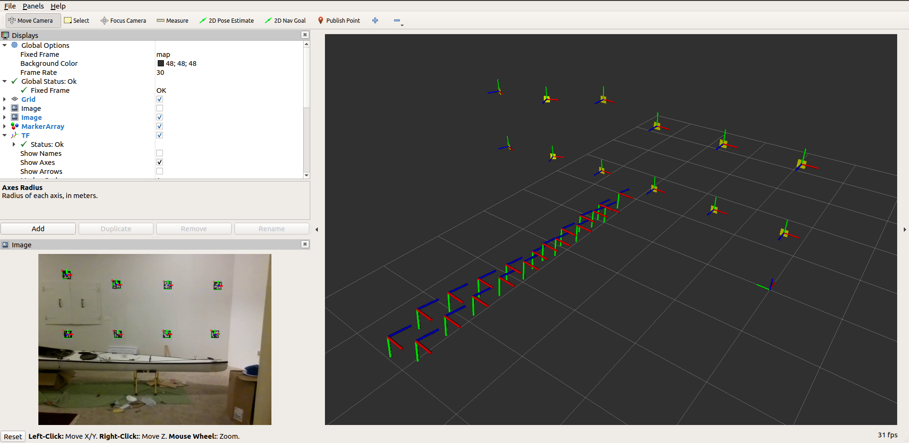

# fiducial_vlam

### The map of marker poses.

The map is a list of marker poses in the map frame. Each entry in the map list contains the id of
the marker and the pose (x,y,z,roll,pitch,yaw) of the marker in the map frame.

vloc_node takes raw_images and detects marker corners. It publishes these corner locations in a fiducial_vlam/observations
message. If vloc_node has received a map, it will use marker corners
from the image and marker poses from the map to determine and publish the camera pose in map frame.
vmap_node will either load a map from a file and publish it or use observations messages to create and publish
a new map. 

vmap_node parameters for the map:

`make_not_use_map` 0 => load a predefined map from a file and publish it. 1 => create a new map
from observations and periodically publish it and save it to a file.

`marker_map_load_full_filename` the name (+path) of the file that vmap_node loads a map from when vmap_node is
using an existing predefined map. (make_not_use_map==0)

`marker_map_save_full_filename` the name (+path) of the file that vmap_node a discovered map to
when vmap_node is discovering a new map. (make_not_use_map==1)

#### Anchoring a map

vmap_node creates/discovers a map by calculating the relative poses of the markers
from images that contain multiple markers. These relative measurements are anchored
to a particular frame by specifying the pose of one of the markers in that frame.

The following parameters control how vmap_node will anchor a new map:

`map_init_style` is the style of map initialization. The following styles are supported:

* 0 => Load pose of one marker from a file. Look for the marker with id `map_init_id`
in file `marker_map_load_full_filename` and use the pose found to anchor the map.
* 1 => Load pose of one marker from parameters. Use the marker id `map_init_id` and
the pose specified in paramters (`map_init_pose_x`, `map_init_pose_y`, `map_init_pose_z`, 
`map_init_pose_roll`, `map_init_pose_pitch`, `map_init_pose_yaw`) to anchor the map.
* 2 => Initial camera pose from parameters. The parameters (
`map_init_pose_x`, `map_init_pose_y`, `map_init_pose_z`, 
`map_init_pose_roll`, `map_init_pose_pitch`, `map_init_pose_yaw`) specify the initial
pose of the camera in the map frame. The pose of new markers in the map frame are determined
based on this specified camera pose.

